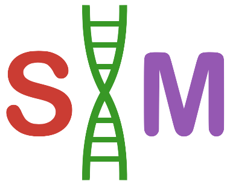

# XSim

[](https://travis-ci.org/reworkhow/XSim.jl)
[](https://reworkhow.github.io/XSim.jl/index.html)



XSim is a fast and user-friendly tool to simulate sequence data and complicated pedigree structures

* **Homepage**: [QTL.rocks](https://QTL.rocks)
* **Discussion group**: [available here](https://groups.io/g/qtlrocks)
* **Installation**: at the Julia REPL, `using Pkg; Pkg.add("XSim")`
* **Documentation**: [available here](https://reworkhow.github.io/XSim.jl/index.html)

#### Features

* An efficient CPOS algorithm
* Using founders that are characterized by real genome sequence data
* Complicated pedigree structures among descendants

#### Quick-start

```Julia
# Load XSim
using XSim

# Simulate genome with 10 chromosomes, and 100 markers are located on each chromosome.
build_genome(n_chr=10, n_marker=100)
# Simulate two independent traits controlled by 3 and 8 QTLs, respectively.
build_phenome([3, 8])

# Initialize founders
n_sires = 3
n_dams  = 20
sires   = Founders(n_sires)
dams    = Founders(n_dams)

# Define parameters
args     = Dict(# mating
                :nA               => 3,
                :nB_per_A         => 5,
                :n_per_mate       => 2,
                :ratio_malefemale => 1.0,
                # selection
                :h2               => [.8, .5],
                :weights          => [.6, .4],
                # breeding
                :n_gens           => 5,
                :n_select_males   => 3,
                :n_select_females => 20)

# Breeding program
sires_new, dams_new   = breed(sires, dams; args...)

# Inspect the results
summary(sires + dams)
summary(sires_new + dams_new)

```


#### Help

Old users may install the old version of XSim as `using Pkg; Pkg.add(name="XSim", version="0.5")`

* **Authors**: Hao Cheng,Rohan Fernando,Dorian Garrick
* **Citing XSim** 

>Cheng H, Garrick D, and Fernando R (2015) XSim: Simulation of descendants from ancestors with sequence data. G3: Genes-Genomes-Genetics, 5(7):1415-1417.
