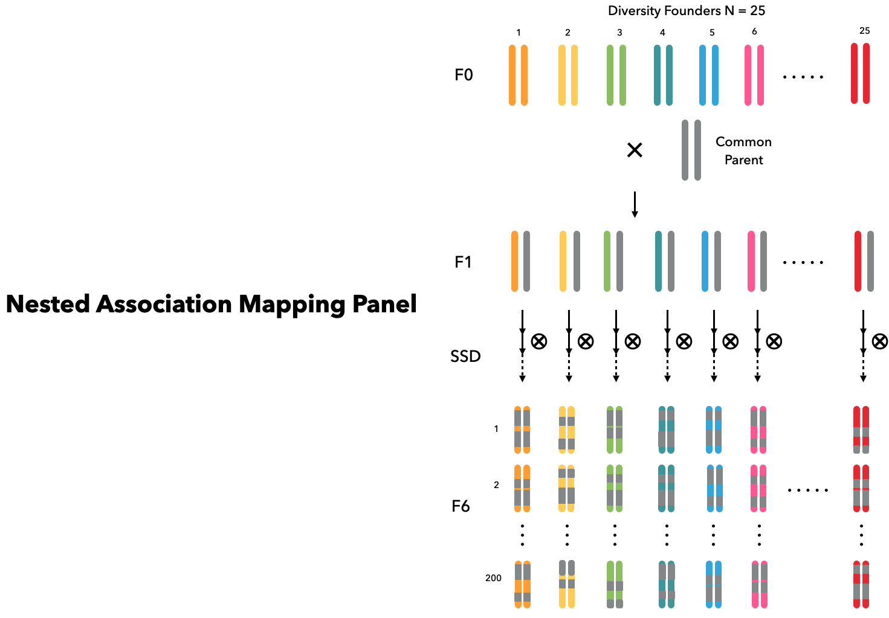

# Nested Association Mapping


Nested association mapping (NAM) design  (Buckler et al. 2009) is useful in plant breeding for its statistical power in detecting QTLs (Scott et al. 2020). Assuming the studied species is an out-cross crop, we initialize founders in the same way as in the previous example. The base population is simulated to have historical LD and in HWE after more than 1000 generations of random mating. Founders of NAM panel are determined by 25 diversity founders and 1 common parent subsetted from the simulated base population.
```julia
# Build Genome and Phenome
build_genome("map.csv")
build_phenome("map.csv",
              vg = [ 1 .5; .5  1],
              h2 = [0.3, 0.7])
# Initialize a population with 1,500 founders
founders = Founders(1500)
# Let founders random mate with each other
# for 1,000 generations 
for _ in 1:1000
    founders = mate(founders)
end
# Drop the size to 100 individuals and
# continue the random mating for another 15 generations
for _ in 1:15
    founders = mate(founders[1:100])
end
# Subset 26 founders to become the base population
common_parents  = founders[1]
diverse_parents = founders[2:26]
```

We let each founder mate with the common parent separately to generate 25 families in the generation $F_1$. Later, in each families, 200 recombinant inbred lines (RILs) are derived with selfing for 6 generations. Overall, we can have a NAM population with 25 families containing 200 RILs each through the following codes:
```julia
# Cross each diverse parent with the common parent
F1 = Cohort()
for parent in diverse_parents
    F1 += common_parents * parent
end
# Each family produce 200 progenies by selfing
args = Dict(# Mating
            :n_per_mate => 200,
            :is_selfing => true,
            # Selection
            :is_random  => true,
            # Breed
            :n_gens     => 6,
            :n_select   => 200)
NAM = Cohort()
for family in F1
    NAM += breed(family, args...)
end
```

## References
Buckler, E. S., J. B. Holland, P. J. Bradbury, C. B. Acharya, P. J. Brown, et al., 2009 The Genetic Architecture of Maize Flow- ering Time. Science 325: 714–718

Scott, M. F., O. Ladejobi, S. Amer, A. R. Bentley, J. Biernaskie, et al., 2020 Multi-parent populations in crops: a toolbox integrating genomics and genetic mapping with breeding. Heredity 125: 396–416.
