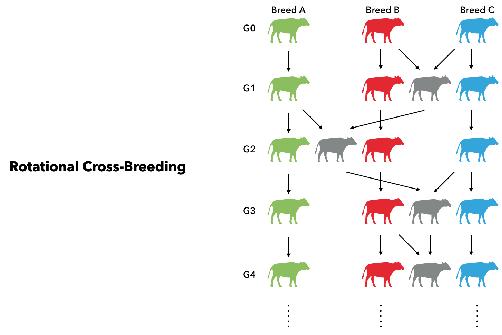

# Rotational Cross-Breeding



At first, a cattle founder population can either be initialized based on real haplotypes or genotypes (described in the section "generating founders"), or be simulated from a base popula- tion in linkage and Hardy–Weinberg equilibria through random mating over many generations to generate LD. We start with a population of 1500 individuals. Except for selfing, we let them randomly mate for 1000 discrete generations. In order to expand the LD range, we drop the population size to 100, and have them random matings for another 15 generations. This approach is similar to that proposed in (Habier et al. 2010), which shows the similarity to real dairy cattle (de Roos et al. 2008). By default, the `mate()` function can have all individuals from the input cohort mating randomly with each other:
```julia
# Build Genome and Phenome
build_genome("map.csv", species = "cattle")
build_phenome("map.csv",
              vg = [ 1 .5; .5  1],
              h2 = [0.3, 0.7])
# Initialize a population with 1,500 founders
founders = Founders(1500)
# Let founders random mate with each other
# for 1,000 generations 
for _ in 1:1000
    founders = mate(founders)
end
# Drop the size to 100 individuals and
# continue the random mating for another 15 generations
for _ in 1:15
    founders = mate(founders[1:100])
end
sires_base = dams_base = founders
```

Secondly, three pure breeds (breed A, B, and C) are generated in generation $G_0$ from the founder population through random matings for 10 generations. In breed A, 50 sires and 500 dams are randomly selected, and each sire is mated with 10 dams. The ratio of male over female is 1. In both breed B and C, 100 sires and 2000 dams are randomly selected, and each sire is mated with 20 dams. Thus, three pure breeds are simulated, where breed A is a small breed with 50 males and 500 females, and both breed B and C have 100 males and 2000 females.
```julia
#Simulate three pure breeds
args_A  = Dict(# Mating
               :nA               => 10,
               :nB_per_A         => 2,
               :ratio_malefemale => 1,
               # Selection
               :is_random        => true,
               # Breeding
               :n_gens           => 10,
               :n_select_males   => 50)
args_BC = Dict(# Mating
               :nA              => 20,
               :nB_per_A        => 2,
               :ratio_malefemale => 1,
               # Selection
               :is_random        => true,
               # Breeding
               :n_gens           => 10,
               :n_select_males   => 100)
# Breed A, B, and C
sires_A, dams_A = breed(sires_base, dams_base;  args_A...)
sires_B, dams_B = breed(sires_base, dams_base;  args_BC...)
sires_C, dams_C = breed(sires_base, sires_base; args_BC...)
```

Thirdly, we sample 100 sires from breed B and 1000 dams from breed C as two mating cohorts. Each sire will mate with 10 dams and leads to 1,000 male and 1,000 female progenies at generation $G_1$. which will be sires and dams in the next generation $G_2$. In $G_2$, we use 50 sires from Breed A and cross them with dams from $G_1$. And we can generate another 1,000 males and 1,000 females as parents for the next round. In $G_3$, 100 sires sampled from Breed C will mate with $G_2$ and produce another 2,000 progenies. The sire sources in the next generation will be back to Breed B and the cycle continues. The described process can be adequately expressed in XSimV2:

```julia
# Rotation parameters
args = Dict(:n_pop            => 2000,
            :n_per_mate       => 2,
            :ratio_malefemale => 1)
# Rotation (G1)
sires_A, dams_A      = mate(sires_A, dams_A)
sires_B, dams_B      = mate(sires_B, dams_B)
sires_C, dams_C      = mate(sires_C, dams_C)
males_G1, females_G1 = mate(sires_B, dams_C; args...)
# Rotation (G2)
sires_A, dams_A      = mate(sires_A, dams_A)
sires_B, dams_B      = mate(sires_B, dams_B)
sires_C, dams_C      = mate(sires_C, dams_C)
males_G2, females_G2 = mate(sires_A, females_G1; args...)
# Rotation (G3)
sires_A, dams_A      = mate(sires_A, dams_A)
sires_B, dams_B      = mate(sires_B, dams_B)
sires_C, dams_C      = mate(sires_C, dams_C)
males_G3, females_G3 = mate(sires_C, females_G2; args...)
```
## References
de Roos, A. P. W., B. J. Hayes, R. J. Spelman, and M. E. God- dard, 2008 Linkage Disequilibrium and Persistence of Phase in Holstein–Friesian, Jersey and Angus Cattle. Genetics 179: 1503–1512.

Habier, D., J. Tetens, F.-R. Seefried, P. Lichtner, and G. Thaller, 2010 The impact of genetic relationship information on ge- nomic breeding values in German Holstein cattle. Genetics Selection Evolution 42: 5.