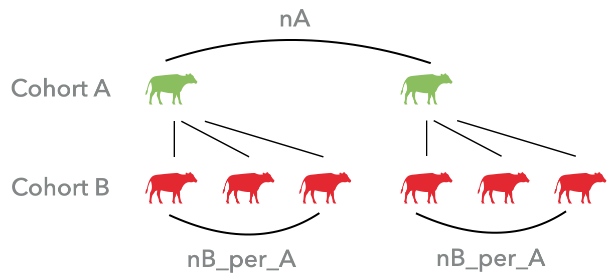

# Mating


```@contents
Pages = ["mate.md"]
Depth = 4
```

    mate(cohort_A         ::Cohort,
         cohort_B         ::Cohort;
         nA               ::Int64=cohort_A.n,
         nB_per_A         ::Int64=1,
         n_per_mate       ::Int64=1,
         replace_A        ::Bool =false,
         replace_B        ::Bool =false,
         ratio_malefemale ::Union{Float64, Int64}=0,
         scheme           ::String ="none",
         args...)

    mate(cohort::Cohort; args...) =  mate(cohort, cohort; args...)

## Arguments
Positional arguments
- `cohort_A` : A `cohort` object that is treated as common mating parents.
- `cohort_B` : A `cohort` object that is a mating pool from which individuals are sampled to mate with `cohort_A`.

Keyword arguments
- `nA` : `nA` individuals will be sampled from `cohort_A` and treated as common parents.
- `nB_per_A` : `nB_per_A` individuals sampled from `cohort_B` will mate with each individual from `cohort_A`.
- `n_per_mate` : `n_per_mate` progenies will be reproduced from each pair of mating parent.
- `replace_A` : Whether the sampling is replacable in `cohort_A`.
- `replace_B` : Whether the sampling is replacable in `cohort_B`.
- `ratio_malefemale` : By default, two cohorts which are male and female progenies will be returned. `ratio_malefemale` defined the progenies ratio of males over females. If `ratio_malefemale=0`, only one cohort will be returned.
- `scheme` : Available options are ["random", "diallel cross", "selfing", "DH"]. See the examples for more details.

## Outputs
By default, two `cohort` objects will be returned. The first `cohort` is assumed to be male progenies and the other `cohort` are female progenies. The size of two cohorts will folow the ratio `raiot_malefemale`. When `ratio_malefemale` is set to `0`, only one `cohort` will be returned.


## Examples
### Random Mating (Default)
Initialize cohorts
```jldoctest
julia> cohort_A = Cohort(5)
julia> cohort_B = Cohort(10)
```
Define mating events
```jldoctest
julia> args = Dict(:nA               => cohort_A.n,
                   :nB_per_A         => 1,
                   :replace_A        => false,
                   :replace_B        => false,
                   :n_per_mate       => 1)
julia> progenies = mate(cohort_A, cohort_B; args...)

# Equivalent
julia> progenies = mate(cohort_A, cohort_B)

# Equivalent
julia> progenies = mate(cohort_A, cohort_B; scheme="random")

# Equivalent
julia> progenies = cohort_A * cohort_B
```

Check the pedigree to see if the mating goes as desired.
```jldoctest
julia> get_pedigree(progenies)
5×3 LinearAlgebra.Adjoint{Int64,Array{Int64,2}}:
 19  1   8
 16  2   6
 17  3  10
 20  4  15
 18  5  14
```

### Diallel Cross
Initialize cohorts
```jldoctest
julia> cohort_A = Cohort(2)
julia> cohort_B = Cohort(5)
```
Define mating events
```jldoctest
julia> args = Dict(:nA              => sires.n,
                   :nB_per_A        => dams.n,
                   :replace_A       => false,
                   :replace_B       => false,
                   :n_per_mate      => 1,
                   :ratio_malefemale=> 1)
julia> male, female = mate(cohort_A, cohort_B; args...)

# Equivalent
julia> male, female = mate(cohort_A, cohort_B; scheme="diallel cross")
```

Check the pedigree to see if the mating goes as desired.
```jldoctest
julia> get_pedigree(male + female)
10×3 LinearAlgebra.Adjoint{Int64,Array{Int64,2}}:
 12  2  7
 10  2  6
 11  2  4
 14  1  3
 15  1  5
  9  2  5
 13  1  6
 17  1  4
  8  2  3
 16  1  7
```

### Selfing
Initialize cohorts
```jldoctest
julia> parents = Cohort(5)
```

In the selfing scheme, only one `cohort` is required.
```jldoctest
julia> args = Dict(:nA          => 3,
                   :replace_A   => false,
                   :n_per_mate  => 5,
                   :scheme      => "selfing")
julia> progenies = mate(parents; args...)
```
Inspect the pedigree to verify the mating behavior
```jldoctest
julia> get_pedigree(progenies)
15×3 LinearAlgebra.Adjoint{Int64,Array{Int64,2}}:
  6  4  4
  7  4  4
  8  4  4
  9  4  4
 10  4  4
 11  1  1
 12  1  1
 13  1  1
 14  1  1
 15  1  1
 16  5  5
 17  5  5
 18  5  5
 19  5  5
 20  5  5
```

### Mating with the pedigree defined
Define a genome containing 4 loci
```jldoctest
julia> build_genome(n_loci=4, n_chr=1)
```

Simulate a trait controlled by 2 loci
```jldoctest
julia> build_phenome(2, h2=.5)
```

Load demo pedigree data frame
```jldoctest
julia> ped = DATA("pedigree")
5×3 DataFrame
 Row │ Column1  Column2  Column3 
     │ Int64    Int64    Int64   
─────┼───────────────────────────
   1 │       1        0        0
   2 │       2        0        0
   3 │       3        0        0
   4 │       4        1        2
   5 │       5        1        2
```

Create a cohort
```jldoctest
# Option 1: with simulated genotypes
julia> cohort = Cohort(3)
# Option 2: with real genotypes
julia> genotypes = DATA("genotypes")
5×4 DataFrame
 Row │ Column1  Column2  Column3  Column4 
     │ Int64    Int64    Int64    Int64   
─────┼────────────────────────────────────
   1 │       2        0        0        1
   2 │       0        0        1        0
   3 │       0        1        0        2
   4 │       1        1        0        2
   5 │       2        0        2        0

julia> cohort = Cohort(genotypes)
julia> cohort|>get_genotypes
5×4 Array{Int64,2}:
 2  0  0  1
 2  0  2  0
 0  0  1  0
 0  1  0  2
 1  1  0  2
```

Generate offsprings with the defiend pedigree
```jldoctest
julia> offsprings = mate(ped)
```

Examine the genotypes
```jldoctest
julia> offsprings |> get_genotypes
5×4 Array{Int64,2}:
 2  0  0  1
 2  0  2  0
 0  0  1  0
 2  0  1  0
 2  0  1  0
```

